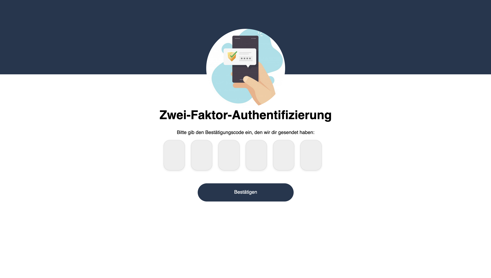
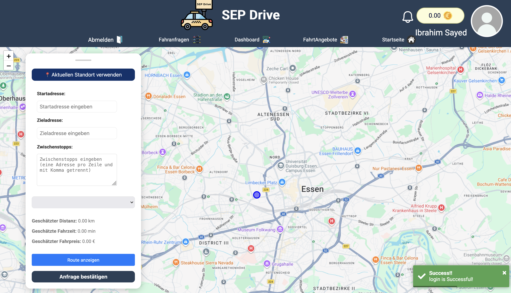
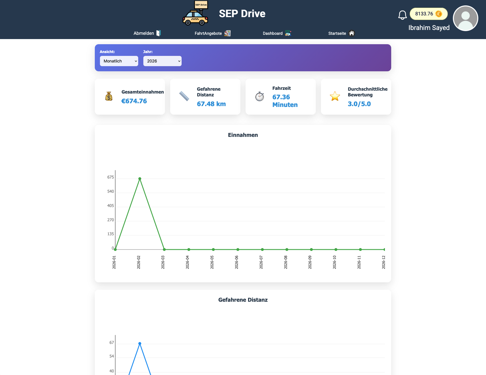
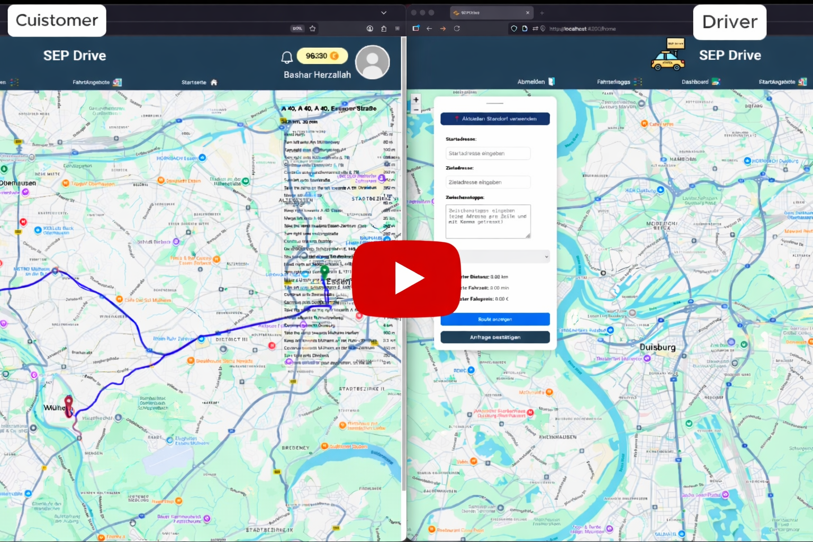

# 🚗 SEP-Drive — Ride Sharing Platform


SEP-Drive is a full-stack ride-sharing platform developed as part of the **Software Engineering Project (SEP)** course.

The system allows customers to request rides and drivers to accept and complete them, including real-time simulation, payments, chat functionality, statistics, and leaderboards.

---

# 📖 Table of Contents

* [Overview](#overview)
* [Features](#features)
* [Architecture](#architecture)
* [Technology Stack](#technology-stack)
* [Installation](#installation)
* [Screenshots](#screenshots)
* [Project Structure](#project-structure)
* [License](#license)

---

# 🧭 Overview

SEP-Drive is designed to simulate a modern ride-sharing ecosystem similar to Uber or Bolt.

The platform supports:

* User registration & authentication with 2FA
* Ride request creation and route planning
* Driver offers and customer acceptance
* Real-time ride simulation
* Wallet & payment system
* Chat communication
* Statistics and leaderboard analysis

The project was developed iteratively across **three development cycles**.

---

# 🚀 Features

## 🔹 Cycle I — Core System

* User registration (Customer / Driver)
* Login with Two-Factor Authentication
* User profiles and profile search
* Map visualization and routing
* Ride request creation and management
* System architecture diagrams
* Backend and frontend integration
* Docker setup

---

## 🔹 Cycle II — Advanced Ride Management

* Wallet system (customer & driver accounts)
* Distance, duration, and price calculation
* Driver dashboard with sortable ride requests
* Automatic route planning
* Ride offers workflow
* Real-time ride simulation with WebSockets
* Ride history tracking
* Payment transactions

---

## 🔹 Cycle III — Smart Features

* Real-time chat between driver and customer
* Multi-stop route planning
* Driver statistics dashboard
* Leaderboard ranking system
* Live route modification during rides
* Notification system
* Advanced backend services

---

# 🏗️ Architecture

The system follows a **modular full-stack architecture**:

Frontend → Backend → Database → External APIs

### Components

* Angular Frontend (UI + Map + Simulation)
* Spring Boot Backend (REST + WebSocket)
* PostgreSQL Database
* Docker Infrastructure
* External Routing API (OSRM / OpenRouteService)

---

# 🧰 Technology Stack

## Backend

* Java
* Spring Boot
* Spring Security
* JWT Authentication
* WebSocket (STOMP)
* JPA / Hibernate
* PostgreSQL

## Frontend

* Angular
* TypeScript
* Leaflet Maps
* HTML / CSS

## DevOps

* Docker
* Docker Compose
* Git / GitHub

---

# ⚙️ Installation

## Requirements

* Docker
* Node.js (optional for development)
* Java 17+
* Maven

## Run with Docker

```bash
git clone https://github.com/your-repo/sep-drive.git
cd sep-drive
docker-compose up --build
```

Frontend:

```
http://localhost:4200
```

Backend:

```
http://localhost:8080
```

---

# 📸 Screenshots

## Welcome


## Login


## 2FA


## Reset Password


## Sign up


## Map & Ride Simulation 



## Dashboard & Statistics




## 🎥 Demo Video

[](https://youtu.be/q8bOjwAN3CA)

---

# 📂 Project Structure

```
SEP-Drive
│── backend
│   ├── controller
│   ├── service
│   ├── model
│   ├── repository
│   └── config
│
│── frontend
│   ├── components
│   ├── services
│   ├── models
│   └── assets
│
│── docker
│── docs
```


---

# 🧪 Testing

The project includes:

* Module Tests
* System Tests
* Integration Tests
* Simulation validation tests

---

# 📊 Key Functional Modules

* Authentication & Authorization
* Ride Management
* Simulation Engine
* Wallet & Transactions
* Chat System
* Notifications
* Statistics & Leaderboard

---

# 🎓 Academic Context

This project was developed within the Software Engineering curriculum and demonstrates:

* UML modeling
* Agile development cycles
* Full-stack engineering
* DevOps deployment
* Real-time system design

---

# 📜 License

This project was created for academic purposes.

---

# ⭐ Author

University Project — Software Engineering
